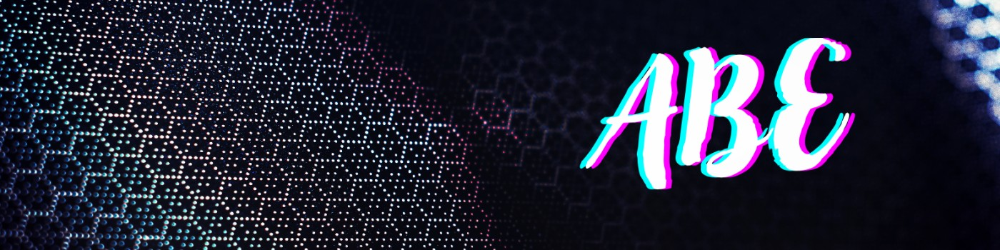

# Alili Mohamed Baha Eddine

**I build worlds, code systems, and make ideas playable.**

---

## About Me

- Engineering student at **CESI Engineering School** — Blida, Algeria
- I build **AR/VR & XR experiences** and games with **Unity** and **Unreal Engine**
- I train and ship **computer-vision & ML models** (YOLOv8, TensorFlow/Keras, PyTorch) — down to **edge devices**
- Full-stack developer: **Next.js / React** front-ends, **FastAPI / Django / Node.js** back-ends, **Flutter** mobile apps
- **1,100+ contributions in the last year** — most of it in private client work
- **Open to freelance projects and full-time roles** — [resume](https://drive.google.com/file/d/1d0pC-99pNjJoOlJpf7D-0bIyR6ys_lgi/view?usp=sharing) · [bahaeddine.alili@gmail.com](mailto:bahaeddine.alili@gmail.com)

---

## Featured Projects

| Project | What it is | Built with |
|---|---|---|
| **[Project Swarm](https://github.com/ABE1617/Project-Swarm)** | Local-first visual workflow automation engine — n8n-style drag-and-drop canvas, branch-aware async execution, live per-node run status over WebSocket | Python · FastAPI · React |
| **[ShaderDrop](https://github.com/ABE1617/ShaderDrop)** | Copy-paste WebGL shader backgrounds for React & Next.js — 9 zero-dependency, fully-typed GLSL components | TypeScript · GLSL · Next.js |
| **[Motion Graphics Kit](https://github.com/ABE1617/remotion-project)** | Plug-and-play Remotion components for 9:16 short-form video — unified timing & positioning APIs, built-in enter/exit animations | TypeScript · Remotion · React |
| **[AI Bakery Cashier](https://github.com/ABE1617/AI-Bakery-Cashier-app)** | Real-time smart checkout — custom-trained YOLOv8 model detects bakery items from a webcam, counts them and totals the bill | Python · YOLOv8 · OpenCV |
| **[Bird Species Classifier](https://github.com/ABE1617/Bird-Species-Classification-using-DenseNet121)** | DenseNet121 transfer-learning pipeline — data prep, augmentation, training, mAP & confusion-matrix evaluation | TensorFlow · Keras |
| **[Multi-Truck Route Optimizer](https://github.com/ABE1617/Multi-Truck-Delivery-Route-Optimization-Using-Genetic-Algorithm)** | Genetic algorithm for the multi-vehicle routing problem, written from scratch — custom crossover, mutation and route analytics | Python · NumPy · Seaborn |
| **[Maritime Weather Station](https://github.com/ABE1617/Smart-Maritime-Weather-Monitoring-Station)** | Arduino weather station for ships — temperature, humidity, light & GPS logged to SD with RTC timestamps, 4 operating modes | C++ · Arduino · Sensors |

---

## Client & Private Work

Most of my day-to-day work lives in private client repositories. Recent highlights:

- **Multi-tenant WhatsApp AI platform** — embedded signup, LLM-powered conversations · Django, DRF, Celery, React
- **AI diagnostic copilot for industrial maintenance** — web + mobile clients · FastAPI, Pydantic AI, Next.js, Flutter
- **On-device LLM chat app for Android** (Gemma, fully offline) · Flutter
- **Batch media-processing desktop toolkit for game studios** — images, audio, video, PDF · Next.js, Electron
- **3D flight radar visualization**, CRMs, e-commerce and landing pages for freelance clients

---

## Tech Stack

<table>
  <tr>
    <td><b>Game Dev & XR</b></td>
    <td>
      
      
      
      
    </td>
  </tr>
  <tr>
    <td><b>AI / ML & Vision</b></td>
    <td>
      
      
      
      
      
    </td>
  </tr>
  <tr>
    <td><b>Web & Mobile</b></td>
    <td>
      
      
      
      
      
      
      
      
      
      
    </td>
  </tr>
  <tr>
    <td><b>Databases</b></td>
    <td>
      
      
      
      
    </td>
  </tr>
  <tr>
    <td><b>DevOps & Embedded</b></td>
    <td>
      
      
      
      
      
      
    </td>
  </tr>
</table>

---

## GitHub Stats

  
  

  

<picture>
  <source media="(prefers-color-scheme: dark)" srcset="https://raw.githubusercontent.com/ABE1617/ABE1617/output/github-snake-dark.svg" />
  <source media="(prefers-color-scheme: light)" srcset="https://raw.githubusercontent.com/ABE1617/ABE1617/output/github-snake.svg" />
  
</picture>
